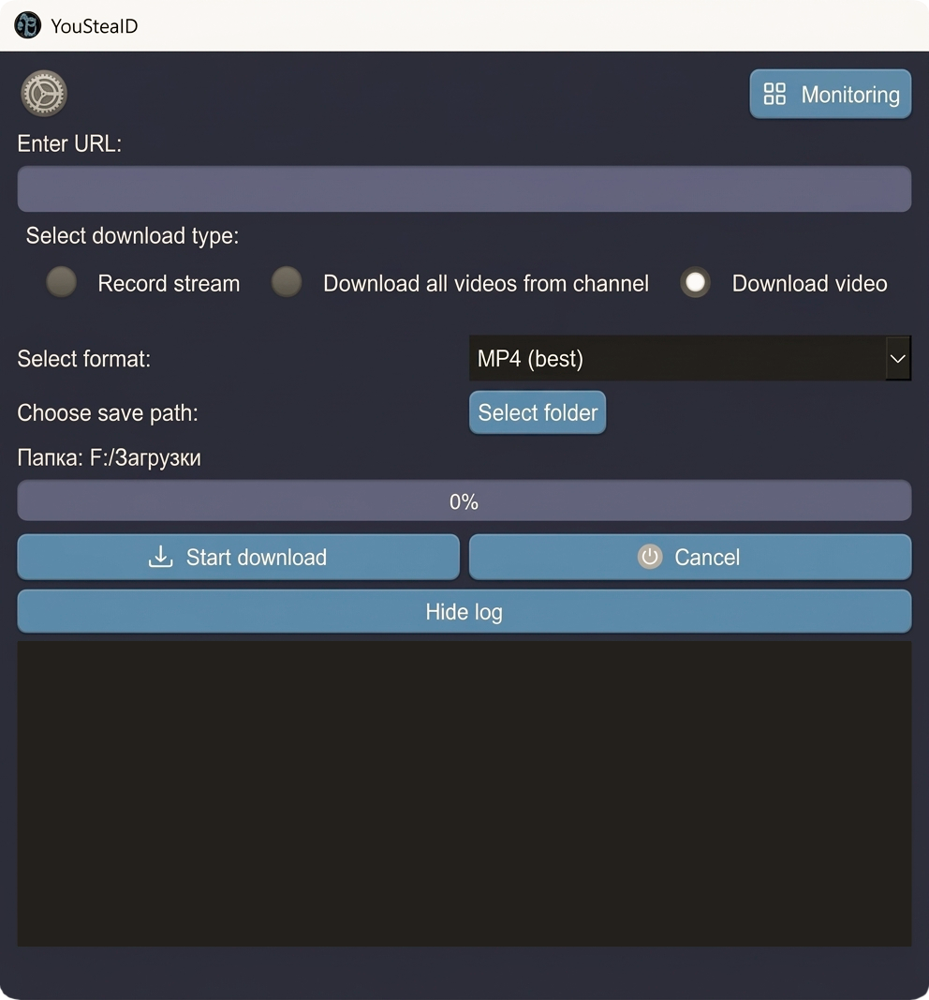

> 🌐 Language: [English](README.md) | [Русский](README.ru.md)

---

# 𝚈𝚘𝚞𝚂𝚝𝚎𝚊𝚕𝙳

**YouStealD** is a Qt-based graphical downloader and stream monitor for YouTube videos, playlists, channels, and live streams.

It allows you to download single videos, playlists, or entire channels, and it can continuously monitor channels for new uploads or live streams and download them automatically.

Authentication is supported via `cookies.txt` files exported from browsers.

Under the hood, YouStealD uses **yt-dlp** and **FFmpeg** for reliable media extraction and processing, with optional **aria2** integration for accelerated multi-connection downloads and support for **HTTP/HTTPS/SOCKS proxies**.

---

## 📸 Screenshot



---

## 🌍 Supported Languages

YouStealD currently supports the following interface languages:

- 🇬🇧 English
- 🇷🇺 Русский
- 🇨🇳 中文
- 🇮🇳 हिन्दी

---

## ✨ Main Features

- **Video / Playlist / Channel download** – select format, resolution, and container (MP4, WebM, or audio-only).
- **Live stream recording** – automatically records streams when they start.
- **Stream monitoring** – watch a channel for new live streams or videos and download them automatically.
- **Authenticated downloads** – supports `cookies.txt` files exported from browsers.
- **High-speed downloads** – optional **aria2** integration with up to **16 connections** for accelerated downloads.
- **Proxy support** – download through **HTTP, HTTPS, or SOCKS proxies**.
- **Download speed control** – optional speed limit for downloads.
- **Custom User-Agent** – override the default User-Agent used for requests.
- **Smart yt-dlp auto-update** – automatically updates yt-dlp when required while avoiding unnecessary updates on cancellations or network errors.

### Format presets

- **MP4**
  - best, 4K, 1440p, 1080p, 720p, 480p, 360p, 240p, 144p
- **WebM**
  - similar quality levels
- **Audio-only**
  - MP3, M4A, WAV, OGG

### Performance tweaks

- 32 MiB buffer size
- 4 concurrent fragments (default), up to 16 with aria2c
- aria2c: 8 connections (with speed limit) or 16 connections (unlimited)
- optional `--no-warnings` to keep the log clean
- improved temporary file handling

---

## ⚙️ Runtime Components

YouStealD relies on several external tools for media extraction and processing:

- **yt-dlp** – media extraction engine
- **FFmpeg** – media processing and merging
- **Deno** – JavaScript runtime used by yt-dlp for YouTube extraction
- **aria2c** *(optional)* – multi-connection downloader for faster downloads

The portable release bundles the required runtime components.

---

## 🛠️ Building and Running (Qt 6+)

### Prerequisites

| Item | Requirement |
|------|-------------|
| Qt | Qt 6 (Core, Gui, Widgets, Network, Xml) |
| Compiler | MSVC, MinGW-w64, or clang |
| Runtime tools | `yt-dlp.exe`, `ffmpeg.exe`, `deno.exe` |
| Optional | `aria2c` (for the `--downloader` option) |

### Build steps

```bash
# Clone the repository
git clone https://github.com/ivan-an/YouStealD.git
cd YouStealD

# Generate Makefile
qmake youtubed.pro

# Compile
mingw32-make
