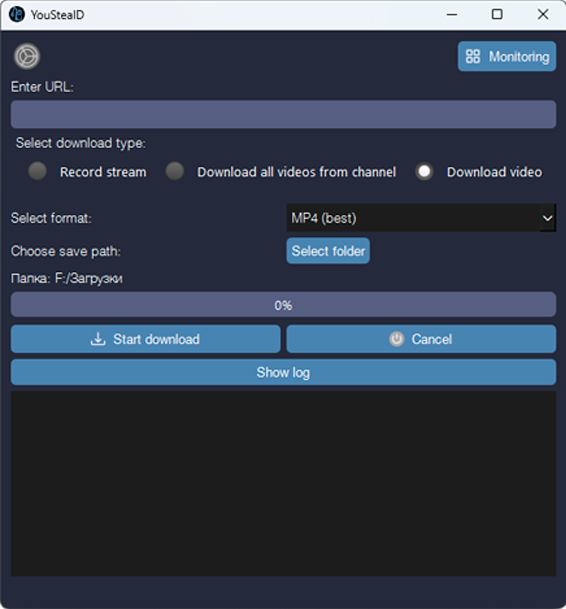

# YouStealD

**YouStealD** is a Qt-based graphical downloader and stream monitor for YouTube.

It allows you to download single videos, playlists, or entire channels, and it can continuously monitor channels for new uploads or live streams and download them automatically.

Authentication is supported via browser cookies or a `cookies.txt` file.

Under the hood, YouStealD uses **yt-dlp** and **FFmpeg** for reliable media extraction and processing, with optional **aria2** integration for accelerated multi-connection downloads and support for **HTTP/HTTPS/SOCKS proxies**.
---

## Screenshot



# ✨ Main Features

- **Video / Playlist / Channel download** – select format, resolution, and container (MP4, WebM, audio-only).
- **Stream monitoring** – watch a channel for new live streams or videos and download them automatically.
- **Authenticated downloads** – use cookies from Chrome, Firefox, Edge (or any Chromium-based browser such as Zen, Brave, Opera) or supply a `cookies.txt` file.
- **High-speed downloads** – optional **aria2** integration for multi-connection downloading.
- **Proxy support** – download through **HTTP, HTTPS, or SOCKS proxies**.
- **Format presets**
  - MP4 (best, 1080p, 720p)
  - WebM (best)
  - Audio-only (MP3)
- **Performance tweaks**
  - 1 MiB buffer
  - 4 concurrent fragments
  - optional `--no-warnings` to keep the log clean
- **JavaScript runtime** – bundles `deno.exe` (or uses a system-installed Deno) so YouTube extraction works without external setup.
- **Modern Qt UI** – animated icons, collapsible log panel, theme-aware colors, and system-tray-style notifications.
- **Cross-platform** – builds on Windows (MinGW/MSVC), Linux, and macOS with the same sources.

---

# 🛠️ Building and Running (Qt 6+)

## Prerequisites

| Item | Requirement |
|-----|-------------|
| Qt | Qt 6 (Core, Gui, Widgets, Network, Xml) |
| Compiler | MSVC, MinGW‑w64, or clang |
| Runtime tools | `yt-dlp.exe`, `ffmpeg.exe`, `deno.exe` |
| Optional | `aria2c` (for the `--downloader` option) |

---

## Build steps

```bash
# Clone the repository
git clone https://github.com/yourname/yousteald.git
cd yousteald

# Generate Makefile
qmake youtubed.pro

# Compile
mingw32-make
